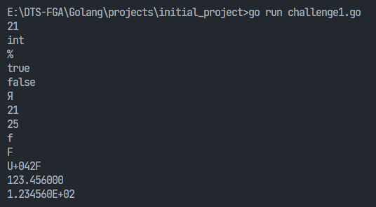

### Requirements
Make go program with following output:
- menampilkan nilai i : 21
- menampilkan tipe data dari variabel i
- menampilkan tanda %
- menampilkan nilai boolean j : true 
- menampilkan nilai boolean j : false
- menampilkan unicode russia : Я (ya)
- menampilkan nilai base 10 : 21 
- menampilkan nilai base 8 :25
- menampilkan nilai base 16 : f
- menampilkan nilai base 16 : F
- menampilkan unicode karakter Я : U+042F
- var k float64 = 123.456;
  - menampilkan float : 123.456000 
  - menampilkan float scientific : 1.234560E+02

### Output
