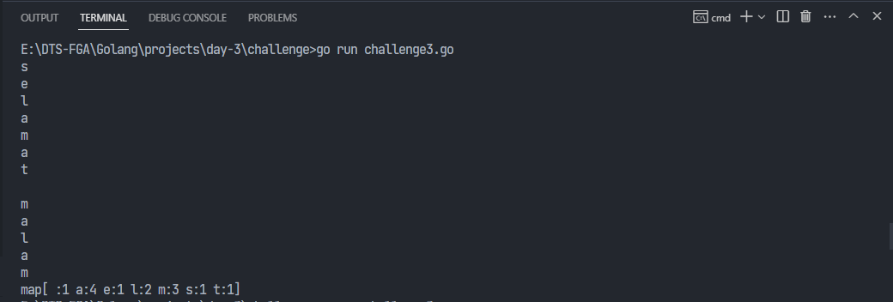

### Requirements
- Perhitungan munculnya kata dari suatu kalimat
- Pecahlah kalimat tersebut menjadi 1 per 1 kata dengan cara mapping golang

### Example input: 
`selamat malam`

### Example output:

