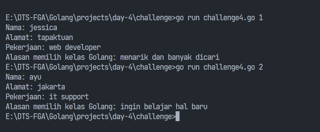

### Requirements
- membuat service berupa CLI untuk menampilkan data teman-teman dikelas berdasarkan nomor absen yang diberikan
- data yang ditampilkan yaitu:
  - Nama
  - Alamat
  - Pekerjaan
  - Alasan memilih kelas Golang

### Example commmand:
```
go run challenge4.go 1
```

### Example output:
