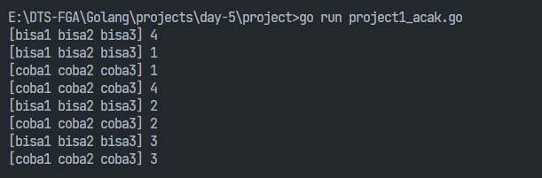
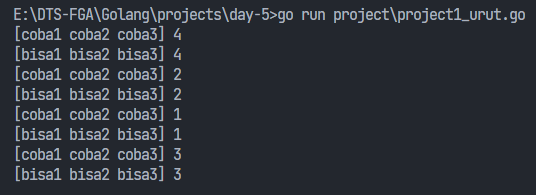

### Requirements
- concurrency dengan GOROUTINE dengan 2 data yang berbeda, tipe data: interface
- output goroutine menampilkan data secara acak dan goroutine menampilkan data secara rapi/teratur
- pemanfaat mutex sederhana dengan fungsi lock dan unlock

### Example output acak:

### Example output urut:
