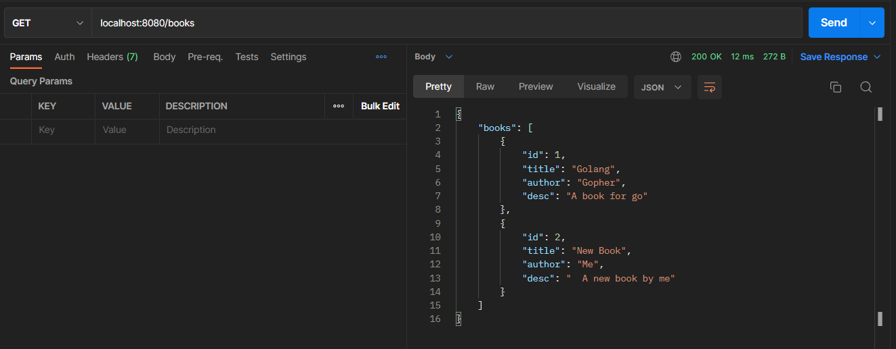
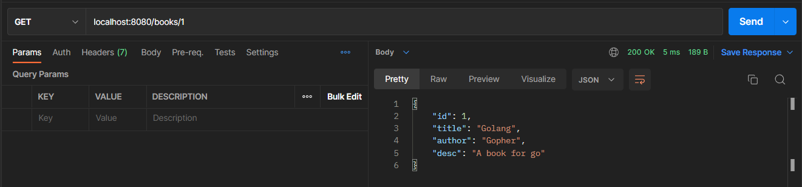
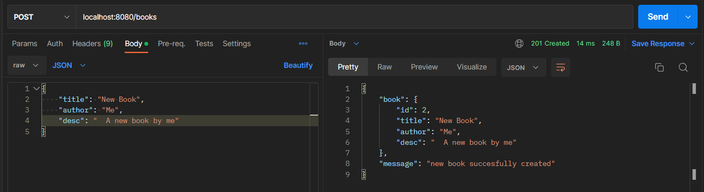
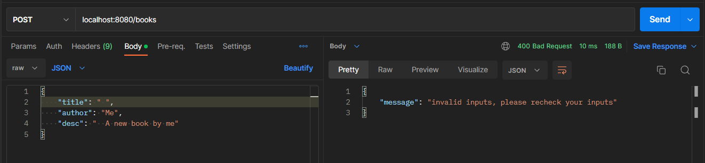
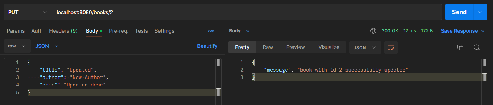
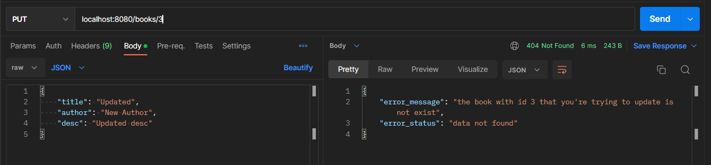
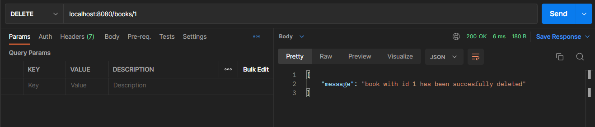
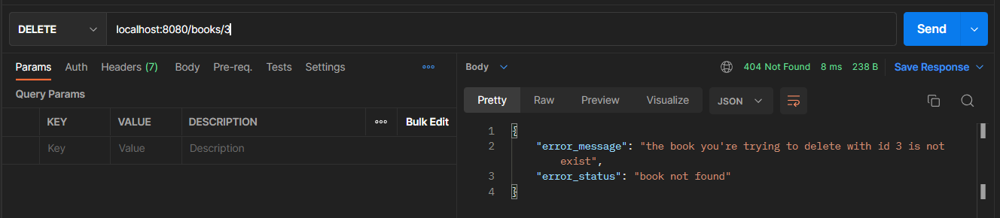

## Requirements
Make simple rest api for books item with method:
- get all book
- get book by id
- add book
- update book
- delete book

## Output
### Get All Books

### Get Book by ID

### Add Book

*Invalid input:*

### Update Book

*If data not exist:*

### Delete Book

*If data not exist:*
