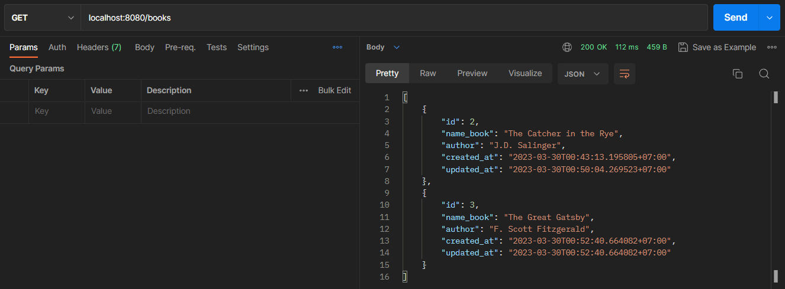
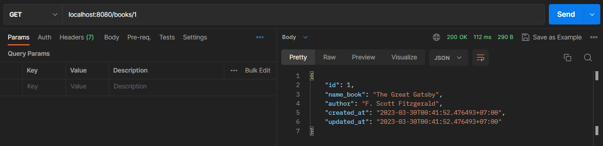
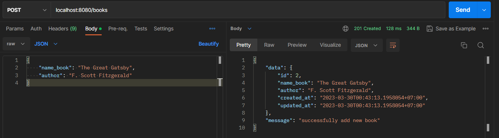
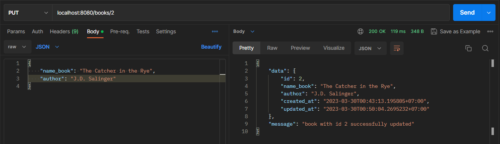
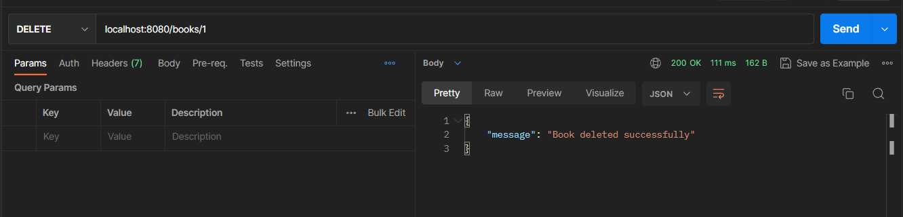

## Requirements
Make simple REST API using GORM and PostgreSQL with following method:
1. Get All Book
2. Get Book By ID
3. Create Book
4. Update Book
5. Delete Book

## How To Run
### Required
- Gin
- GORM
- PostgreSQL

### Config Database
```go
host     = "localhost"
port     = 5432
user     = "postgres"
password = ""
dbname   = "simple_books_api"
```

### Run
```shell script
go run main.go
```

## Documentation
https://documenter.getpostman.com/view/18726863/2s93RTPrWr

## Output
### Get All Books


### Get Book by ID


### Add Book


### Update Book


### Delete Book
